# Enumerator App Guide

The Enumerator App (DHIS2 Data Capture) is used by field officers to onboard traders into the system, capture assessments, and sync data with the central Propa Data server.  
This guide explains how enumerators can **Log in**, **Register traders** and  Submit traders survey data.

Before you start always remember to:

- **Sync data** at the beginning and end of each day in a place with a stable internet connection.  
- **Search first** before registering to avoid duplicates.  
- **Complete all forms** before submitting.  
- **Keep your device charged** while in the field.  
- Report if you experience any **system errors** during onboarding or syncing, **report the issue immediately**.  

## Download & Install the App

You will first download the app from **Google Play Store** the **DHIS2 Data Capture App**.  
 [Click here to download if not installed yet](https://play.google.com/store/search?q=dhis2%20capture&c=apps).  

With this app, you’ll be able to **onboard traders into the system**.

## Login
- Open the Data Capture App.  
- Enter your **Username** & **Password** as provided then paste the url as below:
- **Server URL**:
```bash
 https://fishtrader.exhaustivesoln.com/propa-data
```
- Then tap the **Login** button to access the system.

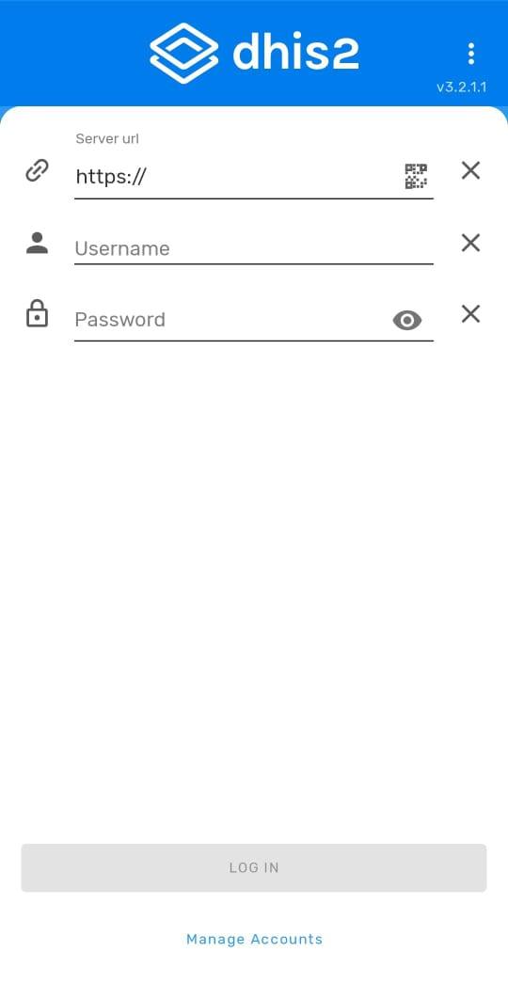


### Sync Data
After logging in, you must sync the app with the server to get the latest trader records.  

- Tap on the **Sync Icon** in the top navigation bar.  
- Ensure you have an active internet connection.  
- The app will pull the latest forms and participant data.  

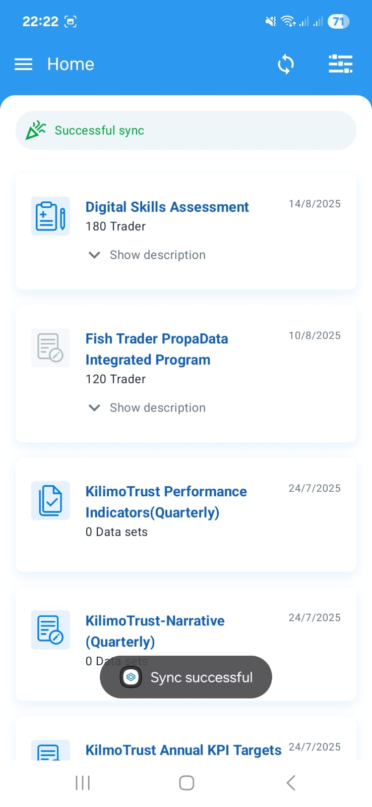


## Registering A Trader
Before registering a new trader, always search to avoid creating duplicates.  

### Searching A Trader

- Select the any of the program or survey as directed and on this case we will be using the  **Digital Skills Assessment Program**.  
- Use any of the search attributes such as **Phone Number**, **First/Last Name**, or **Trader ID**.  

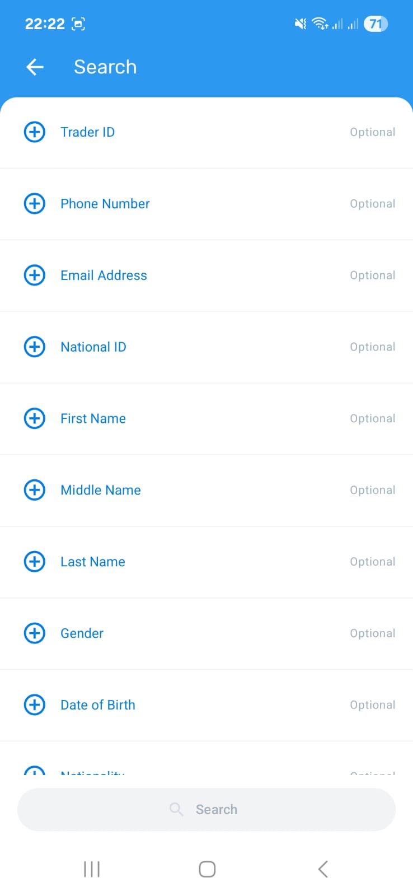

If the trader exists, their profile details will be displayed as in the example below of an existing self registered user.

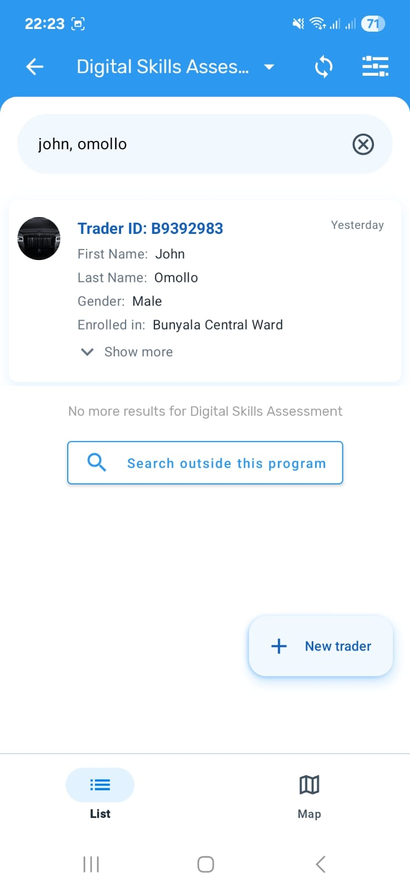

If no match is found:  

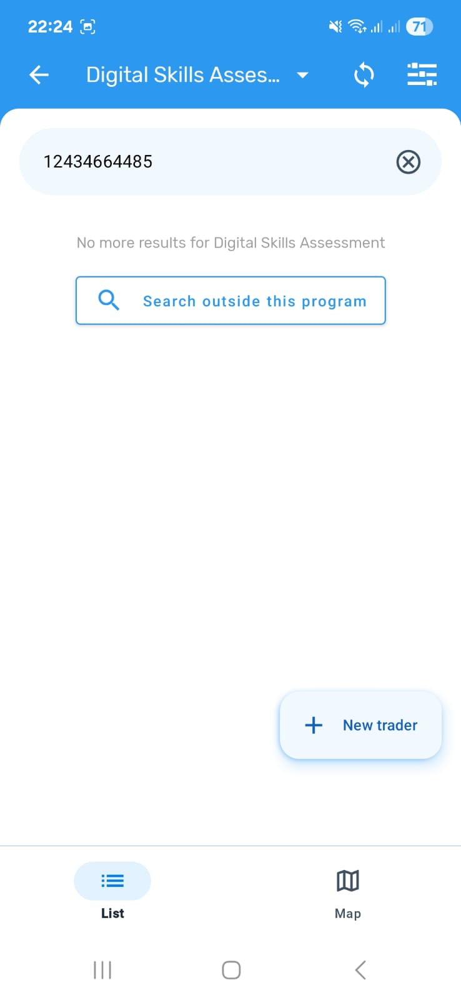

Tap the **+ New Trader** button to register a new one.  


### Onboarding A New Trader

#### Select Organisation Unit
Each trader must be linked to their ward.  

- Search by **Ward**.  
- Select the correct location.  
- Tap **Done** to confirm.  

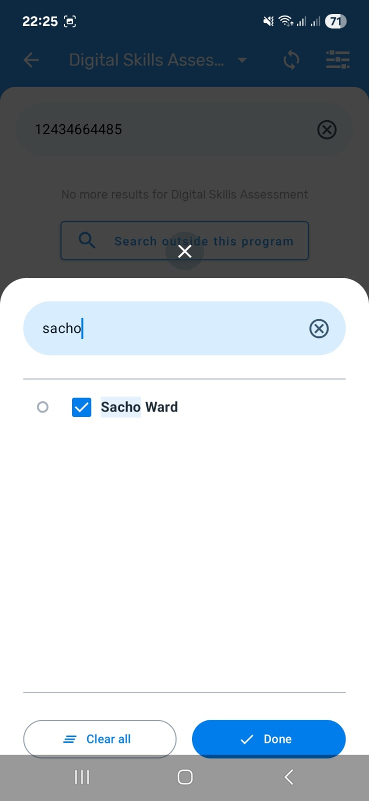

#### Adding Trader Attributes
After selecting the traders Organisation unit you will be directed to the traders registration form which you'll add now the trader details.

- Fill in all **mandatory fields** (marked with an asterisk *).  
- A **Trader ID** will be generated automatically.  


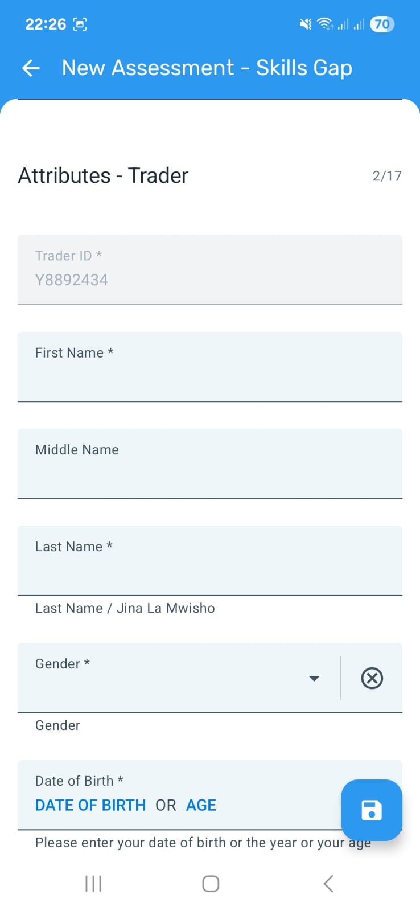

After completing to fill the form click on the save icon which is on the bottom right of the page with a blue background to save the trader details.

### Survey Enrollment

After onboarding a trader, you’ll see a list of available surveys they can participate in. Select the appropriate survey to begin.  
In this demo, we’ll use the **Digital Skills Assessment** survey as an example.

#### Completing a Survey Form

- Start by selecting the **Enrollment Date** and **Assessment Date**.  

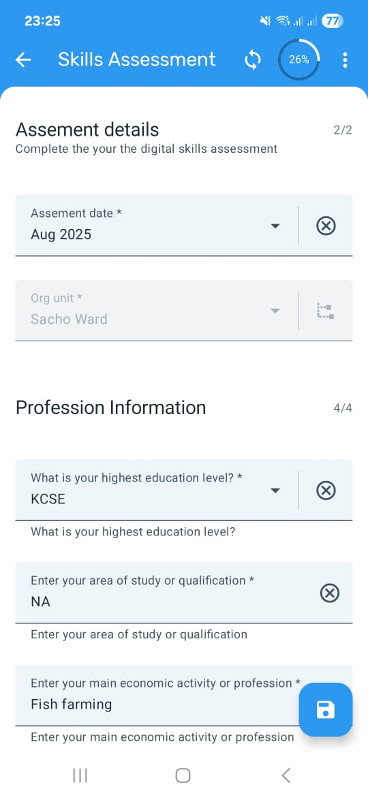

#### Saving Survey Details

Once the form is filled in, click the blue **Save** icon at the bottom right of the page.  
You’ll then have the option to:  
- **Complete** – Save and mark the survey as finished.  
- **Not Now** – Save the survey as a draft for review or completion later.  

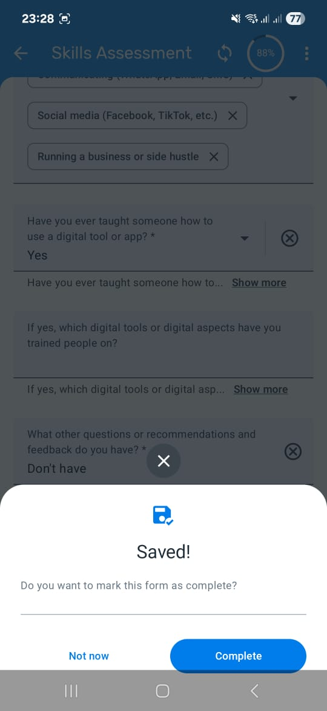

#### Adding Notes to Surveys

During data collection, you can attach notes for additional clarity.  
To add a note, click on the **Notes** button to open the notes page.  

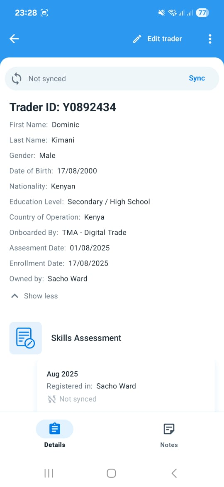

- Tap **+** button to add your note.
- Type your note and save.  
- Review any previously saved notes linked to the same survey.  

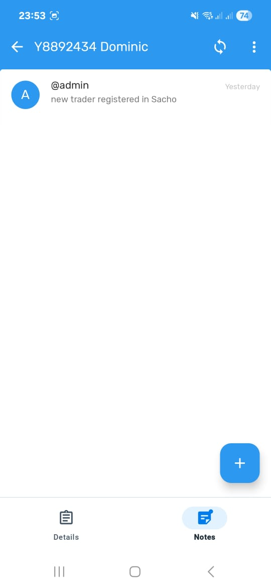
