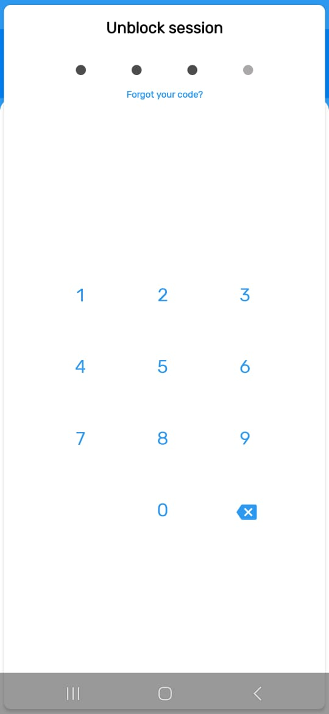

# Enumerator App Guide

The Enumerator App (DHIS2 Data Capture) is used by field officers to onboard participants into the system, capture assessments, and sync data with the central Propa Data server.  
This guide explains how enumerators can **Log in**, **Register Participants** and  Submit  participants survey data.

Before you start always remember to:

- **Sync data** at the beginning and end of each day in a place with a stable internet connection.  
- **Search first** before registering to avoid duplicates.  
- **Complete all forms** before submitting.  
- **Keep your device charged** while in the field.  
- Report if you experience any **system errors** during onboarding or syncing, **report the issue immediately**.  

## Download & Install the App

You will first download the app from **Google Play Store** the **DHIS2 Data Capture App**.  
 [Click here to download if not installed yet](https://play.google.com/store/search?q=dhis2%20capture&c=apps).  

With this app, you’ll be able to **onboard Participants into the system**.

## Login
- Open the Data Capture App.  
- Enter your **Username** & **Password** as provided then paste the url as below:
- **Server URL**:
```bash
 https://fishtrader.exhaustivesoln.com/propa-data
```
- Then tap the **Login** button to access the system.


### Landing Page
Once logged in, you’ll see the Home Dashboard with all the programs listed as shown below.


### Navbar section
From the home page, click on the navigation bar **(menu icon)** to navigate to the navbar section.


## Settings

>  🔑 **Important:** **Do not** tamper or tap on the settings, apart from the one's highlighted below and how to go about them.

### Set PIN Code
From the Side Navbar section click on the Set Pin with a **(Padlock icon)** where you'll be prompted to set a **4-digit PIN** of your liking but **Secure** for faster login access.

>  📝 **NOTE:** After setting the pin you'll be logged out of that section and you'll be prompted to insert the **New Pin** which you have set to have access to the system again.




#### Sync Data

- Go to: **Settings** then click on the **Sync data**   which is on the first row of the different settings.
- Enable: **Sync Data Now** if you have a strong stable internet connection but when under internet connection the sync happens automatically after every one hour.
- After the sync the **Last sync on** will update to the current time you have done the sync


#### Sync Configuration

- Still on the **Settings**  click on the **Sync Configuration**   which is on the second row of the settings.
- Enable: **Sync Configuration Now** if you have a strong stable internet connection but when under internet connection the settings auto update automatically after one day.


#### Reserved Values
Reserved values allow participants registration and program data collection even when offline by providing with reserved unique identifiers.

- Go to: **Settings → Reserved Values**  


- Click on the **Manage Reserved Values** .  

- from there you will be directed to another page indicating how many reserved values you have left, in this case it will be **100** then click on **REFILL** to have the reserved the values.


### Manual Sync
For the **Sync Data** you can also do it from the Homepage section by clicking on the **Sync Icon** (top-right corner)

  

- You should always **manually sync** before starting field work and after finishing the day under a stable internet connection.

- This will update participant records and submit any unsynced data.  

##### successful sync
- After a successful sync a a green notification will be displayed with sync successfull.

  

##### Sync Error
- Incase the sync fails the app will highlight the specific issue why the the sync has failed. But incase it still fails after making changes contact the administrators for more assistance.


<!-- - You can also highlight 
 -->

## Onboarding Participants
Before registering a new participant always search to avoid creating duplicates.  

### Searching A participant

- Select the any of the program or survey as directed and on this case we will be using the  **Digital Skills Assessment Program**.  
- Use any of the search attributes such as **Phone Number**, **First/Last Name**, or **participant ID**.  


#### Existing Participant
If the participant exists, their profile details will be displayed as in the example below of an existing self registered user.


#### Non-Existing Participant


- If on the selected program the partcipant hasn't been found search outside the program on the whole platform to confirm that the participant don't exist on the platform.


Tap the **+ New Trader** button to register a new one.  


### Onboarding A New participant

#### Select Organisation Unit
Each participant must be linked to their ward.  

- Search by **Ward**.  
- Select the correct location.  
- Tap **Done** to confirm.  


#### Adding Participant Attributes
After selecting the participants Organisation unit you will be directed to the participants registration form which you'll add now the participant details.

- Fill in all **mandatory fields** (marked with an asterisk *).  
- A **Participant ID** will be generated automatically.  


After completing to fill the form click on the save icon which is on the bottom right of the page with a blue background to save the participant details.


#### Preview Traders Form


####  Addind A Note
One can add simple notes from the notes section.


## Survey Enrollment
After onboarding a participant, you’ll see a list of available surveys they can participate in. Select the appropriate survey to begin.  

- In this demo, we’ll use the **PropaData Integrated Questionnaire** survey as an example.

- Click on the **Enter Activity** after clicking on the survey for you to be enrolled to the enrollment form.


### Completing a Survey Form

- Start by selecting the **Enrollment Date** and **Assessment Date**.  


#### Saving Survey Details

- Once the form is filled in, click the blue **Save** icon at the bottom right of the page.  


You’ll then have the option to:  
- **Complete** – Save and mark the survey as finished.  
- **Not Now** – Save the survey as a draft for review or completion later.  


#### Adding Notes to Surveys
- During data collection, you can attach notes for additional clarity.  
- To add a note, click on the **Notes** button to open the notes page.  


- Tap **+** button to add your note.
- Type your note and save.  
- Review any previously saved notes linked to the same survey.  


