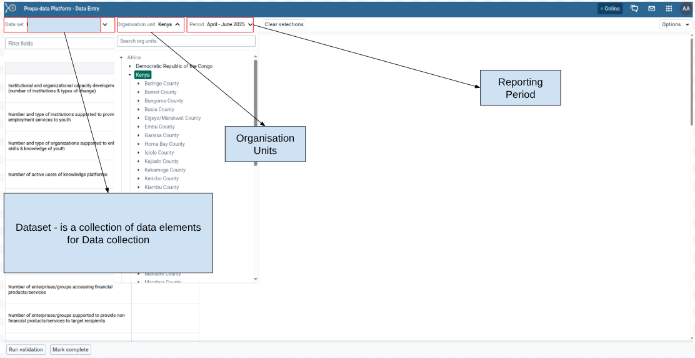
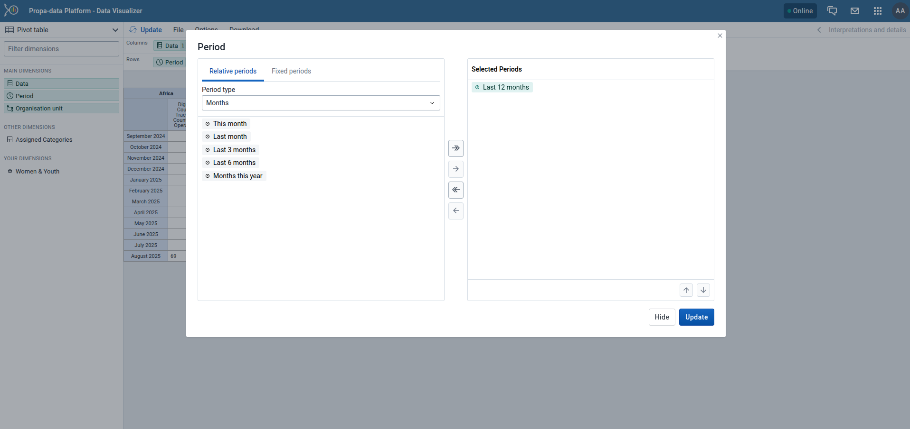
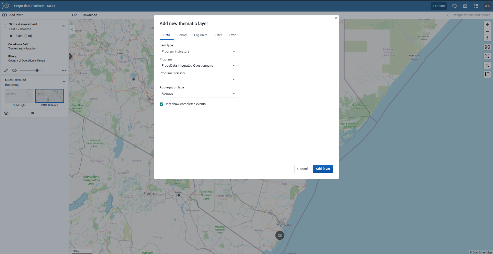
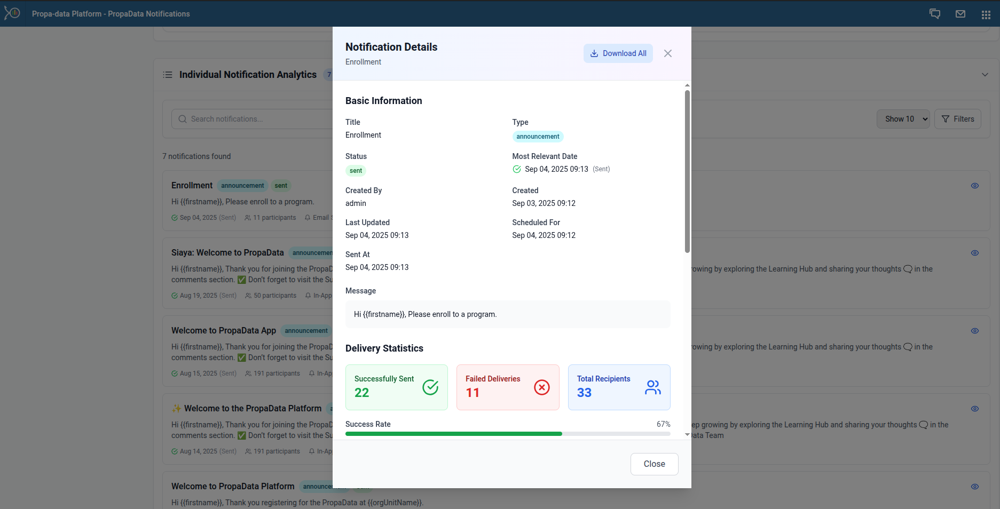

# PropaData Management Platform

## Introduction & User Essentials

### Getting Started with PropaData

#### What is PropaData Platform?

The **PropaData Management Platform** is  a secure, role-based web platform providing unified access for partners and stakeholders. It features high-level analytical dashboards,comprehensive participants data management and data analysis, partner reporting, notifications management, and spatial data mapping and analysis.

#### Purpose and Scope of the Platform
##### Purpose
* Empower women and youth in Africa’s fisheries sector.

* Support inclusive economic growth through data-driven insights

* Improve service delivery and decision making across the program and sector

##### Core Functions
* Centralized data collection and management

* Near real-time monitoring and evaluation

* Unique participants registration.

* Digital record management

* Analytics to track progress and impact

* Inform program design/interventions and policy decisions

### Access and Navigation
Access the platform from here in your preferred browser: [PropaData Platform](https://fishtrader.exhaustivesoln.com/propa-data/dhis-web-login/)

#### Login Access
Insert your login credentials:

- Username
- Password

#### Interface Navigation
The Propa Data platform has a simple and intuitive interface designed to help you access tools and data quickly. This section introduces the key navigation elements.

##### User Profile
On the far right, click on the profile icon to access your account settings i.e, change password, language, appearance and also to logout/ sign out.

##### App Menu (Grid Icon)
PropaData integrates several DHIS2 apps to handle different tasks.  
You can access these apps from the **App Menu** (grid icon at the top right corner).

Examples include:  
- **Data Entry App**: For entering aggregate data.  
- **Capture App**: For registering Participants and recording events.  
- **User Management App**: For user management and adding new  users.  
- **Maintenance App**: For configuring metadata such as programs, data elements, indicators, and organisation units.  
- **Event Reports & Data Visualizer**: For analyzing and visualizing data.  
- **Line Listing**: For analyzing and visualizing detailed records from tracker programs or event programs.  
- **Dashboard App**: For quick access to key performance metrics.  
- **PropaData Notifications App**: For creating and sending notifications to users.  

<!-- 

### Dashboards

Once logged in, you will see **custom dashboards** that summarize key indicators, participant activities, and survey results.  
These dashboards provide quick insights for monitoring and decision making.

 -->
## Data Collection & Management

### Longitudinal Data Capture (Capture App)

The **Tracker Capture App** in PropaData is used to register **participants** and follow them through  activities and records that happen at a specific **Program** and **Organisation Unit** across different program stages. 

#### Managing Participants (Tracked Entity Instances)
The key program participants are treated as **tracked entities**, which allows program officers to search, register, and update participant information.

##### Searching for an Existing Participant

- Always **search before registering a new participant** to avoid duplicates.  
- You can search using attributes such as **phone number, name, or trader ID**.  
- If the participant already exists, the system will redirect you to their **dashboard**.  

##### Registering a New Participant and Capturing Attributes
If the participant does not exist, you can **register them as new participants**. By filling in all mandatory attributes (marked with an asterisk `*`), such as, **Name**, **Gender**, **Phone number**  and the **Organisation Unit (Ward)**  

Once saved, the participant is added to the program as a tracked entity. 

##### Updating Program Records  

If a participant already exists you can **update their records** directly from their **dashboard** and in addition, participants can be **enrolled into new programs** (if not already enrolled) and data can be captured for the relevant program stages.  

  

#### Data Quality and Audit  
To ensure transparency and accountability, every change made to a participant’s record is stored in the **audit trail**.  
The audit trail captures:  

- **User** – who made the change  
- **Data item** – the specific field or record updated  
- **Timestamp** – the exact date and time of the change  

### Aggregate Data Capture (Data Entry App)

The **Data Entry app** in PropaData is used to capture **aggregate information**.  
Aggregate data refers to information collected at a **group level** (i.e, ward, sub-county, county) rather than for a single individual.  

* Some key Features of the Data Entry include:

    - **Organisation Unit Selection**  
        - Choose your ward (or higher level if authorised) before entering data.  

    - **Dataset Selection**  
        - Different datasets represent different forms, e.g., *Trader Onboarding*, *Survey Completion* or *Activities Report*.  

    - **Period Selection**  
         - Enter data for a specific reporting period (weekly, monthly or quarterly, depending on the dataset).  

    - **Forms**  
          - Data entry forms may include numbers, yes/no fields or options. Required fields are highlighted.  

    - **Validation**  
         - Before saving, the system checks your entries (i.e., missing or invalid values).  

    - **Save & Complete**  
          - Use **Save** if you’re still working on the form.  
          - Use **Complete** when all data is filled in correctly. Completed forms lock the period for that dataset.  

    - **Details**  
        - Either View or Hide details
        - View details - to view various details about the data set and also the forms audit logs.

##### Data Set Selection
Choose the **data set** you are reporting on which is a collection of data elements(e.g., Monthly Fish Sales, Training Attendance).  
This are data sets with selected data elements for the specific data collection.

##### Selecting the Organisation Unit
From the organisation unit tree, select your reporting unit (e.g., Country).  

##### Selecting the Reporting Period
Specify the reporting period (e.g., month, quarter, or year) depending on the dataset requirements.  
The available periods are controlled by the period type of the data set (reporting frequency). You can jump a year back or forward by clicking Prev year or Next year.

#### Data Entry Process
##### Entering Data into the Form
- Fill in the values directly into the form fields.  
- Mandatory fields are highlighted and must be completed.  

> A **green** field means that the system has saved the value.

> A **grey** field means that the field is disabled and you can't enter a value. The cursor will automatically jump to the next open field.

- If you type in an invalid value, for example a character in a field that only accepts numeric values, you'll get a pop-up that explains the problem and the field will be coloured **yellow** (not saved) until you have corrected the value.

- If you have defined a minimum maximum value range for the field and you enter a value that is outside this range, you'll get a pop-up message that says the value is out of range. The value remains unsaved until you've changed the value or updated the value range and then re-entered the value.

* Comments can be added to individual data values for clarification.  

##### Data Validation Rules 
- Validation rules check for **consistency and accuracy** of entered data. 
- When you've filled in the form, click Run validation in the top right corner or below the data entry form to check against the set rules (Validation Rules) for the data set.

##### Comments for Data Values 
- Comments can be added to individual data values for clarification.  
- This is useful for explaining anomalies (e.g., unusually high sales due to a local festival).  

#### Data Submission
##### Validation Checks
- Before submission, run **validation checks** to ensure all data entered is correct and complete. 

##### Mark Data Set as Complete
- Once validated, mark the dataset as **Complete** to signal final submission.  

##### Viewing the Audit Trail for a Data Set

The audit trail provides a record of:  
- Who entered or modified data  
- What was changed  
- The exact timestamp of each change  

> 🔑 **Important:** All aggregate data (registrations, surveys, activities) must be entered under your **assigned ward**. This ensures that reporting and dashboards reflect the correct geographic location.

## Data Analysis & Visualization

### Data Extraction and Analysis

#### Analyzing Longitudinal Data

##### Event Reports App

The **Event Reports App** allows users to view and analyze data from PropaData’s tracker programs. It provides **flexible reporting** with options for filtering, aggregating, and exporting individual event records.

You can create two types of reports:

- **Aggregated Event Reports**: Pivot table-style reports showing aggregated numbers of events.  
- **Individual Event Reports**: Line-list style reports showing each event as a separate record.  

###### Creating an Event Report

Follow these steps to build an event report:

1. **Choose Report Type**  
      - Select either **Aggregated values** or **Events**. 

2. **Select Metadata**  
     - From the left-hand menu, choose the **program**, **program stage**, and other dimensions you want to analyze.  

3. **Arrange Dimensions**  
     - Click **Layout** to organize rows, columns, and filters.  
     - You can keep the default layout or customize it to your analysis needs.  

4. **Update Report**  
     - Click **Update** to generate the report.  

###### Selecting Dimension Items

You can add different types of data to your report: **data elements, program attributes, and program indicators**.  

1. **Select Data Elements**  
      - Click **Data**.  
      - Choose a program and a program stage.  
      - The available data elements are listed. Double-click the ones you need.  
      - Selected items appear under **Selected data items**.  

2. **Select Periods**  
      - Click **Periods** and choose your preferred time filter.  
      - Options include:  
        - **Fixed periods** (e.g., January 2024).  
        - **Relative periods** (e.g., Last month, Last 12 months). These update automatically as time moves forward.  
        - **Start/End dates** (custom time range).  

3. **Select Organisation Units**  
      - Click **Organisation units**.  
      - Use the **gearbox icon** to select a mode (single unit, all children, or groups).  
      - Navigate the tree structure (e.g., *Continent → National → SubNational-1 → SubNational-2*) and choose the correct level.

##### Line Listing

Line listing in **PropaData** allows users to view and analyze detailed records from tracker programs or event programs.  
Instead of aggregated numbers, a line listing shows **each individual record (event)** in a tabular format for analysis.

###### Creating A Line List

1. **Input**
      - **Event** → View individual event data from an *event program* or a *tracker program stage*.  
      - **Enrollment** → View data across multiple stages in a *tracker program*.

2. **Program Dimensions**
      - **Data Elements** → Select specific variables from your program (e.g., age, gender, service received).  
      - **Attributes** → Choose tracked entity attributes (e.g., ID number, phone number).  
      - **Program Indicators** → Add calculated indicators relevant to your analysis.

3. **Filter**
      - Apply filters to limit the dataset, for example:
        - Period (date range)
        - Organisation unit(s)
        - Specific attribute values (e.g., gender = female, age = 15–30)

4. **Layout**
      - Drag and drop **dimensions** (data elements, attributes, indicators) into the **Rows** section to define which columns appear in your line list.  
      - Adjust the order of dimensions to organize your table.

5. **Update**
      - Click **Update** to generate the line list with your selected setup.

6. **Export**
      - If needed, Download the report for further use from the Download Button:
        - **Excel (.xlsx)**
        - **CSV (.csv)**
        - **PDF (.pdf)**

#### Analyzing Aggregate Data

##### Data Visualizer App
The **Data Visualizer App** is a powerful tool for program officers to analyze aggregate data and present data collected in PropaData.  
It allows you to create **charts, tables, and pivot views** that help monitor program performance and compare results across different groups or locations.  

###### How to Build a Chart

Follow these steps to create your own visualizations:

1. Select Your Data
    - Choose the **data element** or **indicator** you want to visualize (e.g., *Digital Skills Assessment Completed*).  
    - You can select one or multiple indicators depending on the type of chart.  

    

2. Select the Time Period
      - Choose either a **Relative Period** (e.g., *Last month*, *This quarter*, *This year*)  
      - Or a **Fixed Period** (e.g., *January 2025*, *Q1 2025*).  

3. Select Organisation Units
      - Navigate through the hierarchy (**Country/National → Sub-National1 → Sub-National2**).  
      - Select the area(s) you want to analyze.  

4. Choose the Chart Type
      - Decide how you want to present your data:  
                - **Bar chart** (good for comparisons)  
                - **Line chart** (good for trends over time)  
                - **Pie chart** (good for proportions)  
                - **Tables / Pivot tables** (for detailed breakdowns)  

###### Example Output
Here is a **pie chart** showing **male vs. female participants** who have completed the **Digital Skills Assessment**.  

You can also **download or share** your charts directly from the visualizer.  

##### Maps App  

The **Maps App** allows you to visualize data geographically by overlaying multiple layers, selecting different basemaps, and creating **thematic maps** of areas or points.  
You can also:  
              - View facilities by classifications.  
              - Visualize catchment areas for each .  
              - Combine multiple data dimensions (e.g., program indicators, boundaries, and event data).  

  

###### Creating Thematic and Boundary Layers  

1. **Add a Thematic Layer**  
   - From the **Add layer** menu, select **Thematic**.  
   - This opens the thematic layer configuration dialog.  
     
2. **Select Data Type**  
    Choose the **data type** (e.g., Indicators, Program Indicators, or Event Data).  
    Then select the appropriate **group** and **target element**.  
    The available fields depend on the data type chosen.  

   > **Note:**  
   > You can choose **Only show completed events**.  
   > This option ensures only completed events are included in calculations (useful for excluding partial data in indicator outputs).  

     
3. **Select Periods**  
   - Choose either **Relative periods** (e.g., last month, last 12 months) or **Fixed periods** (e.g., January 2024).  
     
4. **Select Organisation Units**  
   - Pick the **geographic level** you want to analyze (e.g., country → county → sub-county → ward).  
   - Multiple units can be selected.  
5. **Apply Filters (Optional)**  
   - Use the **Filter Tab** to refine results by specific attributes or categories.  
     
6. **Adjust Styles**  
   - Under the **Style Tab**, configure map appearance:  
     - Color schemes  
     - Classification methods (e.g., equal intervals, quantiles)  
     - Legend visibility  
     

<!-- ###### Mapping Locations and Event Data -->

<!--  -->

## Administration & Customization

### User Management

The **User Management App** is where administrators manage access to the PropaData platform.  
From here, you can create users, assign roles, and group users for easier management.

  

#### Adding a New User
**1.** Open the **User Management App**.  
**2.** Click on the **+Add** button.  
**3.** Fill in the required fields such as: 

* **Username**  
* **Full Name**  
* **Password**  

- **E-mail / Phone number** 

- **Expiration Date** - For short term platform users

  

**4.** Assign the user to an **Organisation Unit** 
**5.** Assign **User Roles** based on responsibilities.  

  

**6.** Review the details and click **Create User**.  

  

#### Creating a User Role

User Roles define what apps and functionalities a user can access.  

**1.** In the **User Management App**, go to **User Roles**.  
**2.** Click **Create Role**.  
**3.** Enter:  
   - **Role Name** (e.g., Enumerator Role).  
   - **Description**.  

     

**4.** Assign **App Authorities**:  
   - For enumerators, select **Capture App access only**.  
   - For program officers, include **Data Visualizer, Event Reports, and Dashboards**. 

     
 
**5.** Save the role.  

#### Creating a User Group

User Groups are useful for managing users collectively (Enumerators).  

1. In the **User Management App**, go to **User Groups**.  
2. Click **Create User Group**.  
3. Enter a **Group Name** (Enumerators).  
4. Search and add users to the group.  
5. Save the group.  

- This makes it easier to assign permissions, share dashboards, or send notifications to multiple users at once.  

### System Customization

The **Maintenance App** is where program administrators configure the core building blocks of the PropaData Management System.  
Here you can define **data elements, attributes, indicators and option sets** that power data entry, analysis and reporting.

#### Data Elements
Data elements are the **basic units of information** collected in the system (e.g., *Trader Age*, *Training Completed*, *Business Type*).  
They are the raw data fields used in forms, programs, and indicators.  

- **Example:** *participants with registered businesses*.  

#### Option Sets
Option sets define **predefined lists of choices** for data entry fields.  
This ensures standardization and avoids inconsistent answers.  

- **Example:** Gender (Male, Female), Business Type (Retail, Wholesale, Fish Processor).  

#### Indicators
Indicators are **custom calculations** created from data elements, attributes, or other indicators.  
They turn raw data into **meaningful measures** for monitoring and reporting.  

##### Creating an Indicator
**1.** Open the **Maintenance App** → *Indicators*.  
**2.** Click **+ Add New** and provide:  
      - **Name** → e.g., *Digital Skills Completion Rate*  
      - **Short Name** → used in charts/tables  
      - **Description** → purpose of the indicator  

   
**3.** Build the **Formula**:  
   - **Numerator** → participants who completed training  
   - **Denominator** → Total enrolled participants  

   

**4.** (Optional) Add it to an **Indicator Group** for easy categorization.  
**5.** Save and test it in the **Data Visualizer** app.  

#### Dataset Reports App
The **Event Reports App** is used to generate dataset reports of participants/events for detailed analysis.  

##### Building A Report
- Choose a data set
- Narrow down results by **organisation unit** (country → subnational).  
- Apply filters by **time period** (e.g., last month, last quarter)

##### Saving, Sharing, and Downloading Reports

- Share with colleagues or download in **Excel or PDF** formats.  

### PropaData Notifications

The **PropaData Notifications App** allows you to create, schedule, and track notifications across different channels (SMS, Email, and In-App).

#### Notification Analytics

The **Analytics Dashboard** provides an overview of all notifications sent. It displays:

- **Total Notifications Sent**  
- **Successful Deliveries**  
- **Failed Deliveries**  
- **Total Recipients**  

##### Individual Notification Analytics

You can view detailed analytics for each notification by clicking the **eye icon**.

This displays key details such as:

- Title  
- Status  
- Created By  
- Type  
- Message Body  
- Scheduled Time / Sent Time  

The analytics also show a **delivery breakdown** by channel (SMS, Email, In-App).

#### Creating Notifications

To create a new notification, click **+ Schedule Notification** button.

##### Step 1: Add Notification Details
**Title** – Enter a descriptive title.  
**Message** – Write your message. You can insert **dynamic templates** such as:  
  - First Name  
  - Full Name  
  - Gender  
  - Phone Number  

##### Step 2: Define Notification Settings

- **Type** – Select the notification type.  
- **Delivery Mode** – Choose **Email, SMS, or In-App**.  
- **Target Audience** – Define recipients.  
- **Send Timing** – Send immediately (default: scheduled after 5 minutes) or schedule for a later date/time.  

For scheduled notifications, simply pick your preferred date and time.

Once created, the notification will appear in the list with the status **Scheduled** until it is sent.

#### Notification Audience
The target audience for various notifications

##### Adding a New Audience

When creating an audience, ensure recipients have valid **Email** or **Phone Numbers** (for SMS notifications).

You can select participants directly and apply filters for easier participants filtering and add them to the audience.

After confirming the details, click **Confirm Selection**.  

A confirmation will appear if the audience is valid.

✅ With these steps, you can manage notifications, monitor delivery performance, and ensure effective communication with participants.
