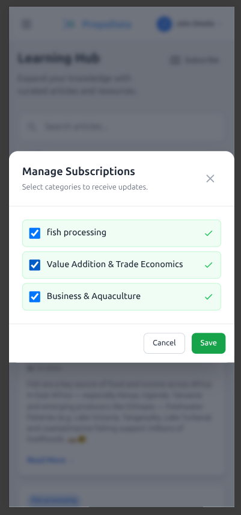

# Introduction to Propa Data

**Propa Data** is a digital platform designed to streamline participant management, data collection, and program delivery and it helps organizations improve efficiency, accuracy, and decision-making through real-time data capture and reporting.  
The platform also supports **language translation to Kiswahili** for wider accessibility.  

The Propa Data system includes the following key modules:

* *User Login & Registration*: Easy self-registration and user login, with guided profile setup.

* *Activity Reporting*: Users can submit regular updates on trading and business activities.

* *Profile Management*: Manage and update business information and documents

* *Notifications & Updates*: Receive real-time alerts and program updates
s
* *Learning Hub*: Access curated articles, tips, and training resources  to support business growth

## User Login & Registration

### User Registration
You can create a Propa Data account in two ways:

* Sign up with email 
* Sign up with Google account 

Access the web application from [https://fish-trader-app.web.app](https://fish-trader-app.web.app)

### **Email Registration**
Fill in the details provided in the registration form:

* **Country** - Choose your country from the dropdown list.  
* **Full Name** - Type your full name.  
* **Email** - Enter a valid email address.  
* **Password** - Create a password you can remember.  
* **Accept Terms** - Before you can register, you must check the box to agree to the **Terms & Conditions** and **Privacy Policy**.

Then Click on the **Sign Up** button below to submit your registration details.

### **Sign Up with Google**
If you already have a google account, click **Sign up with Google** and follow the prompts to create your account instantly but first choose your **Country** from the dropdown list.  

The first Prompt after clicking on the button requiring to type in your email to continue with the process then click on next on each prompt till you've successfully created an account.

### User Login

You can log in to Propa Data using **Google**, **Email**, or **Phone Number (OTP)**.

#### Sign in with Google
You can sign in quickly using your Google account.  

#### Sign in with Email
1. Enter your registered email and password.  
2. Click **Log In** to access your account.  

**Forgot your password?**  
- Click on **"Forgot Password"**.  
- Then click the **"Send Reset Link"** button.  
- Check your email inbox for the link and follow the instructions to reset your password.  

#### Sign in with Phone Number (OTP)
You can also log in using the phone number you registered during sign-up.  
- Enter your phone number and select your country from the list.  
- A One-Time Password (OTP) will be sent to your phone.  
- Enter the OTP to complete your login.  

## User Profile Setup
After a successful sign-up, you will be directed to set up your profile.  

### Primary Organisation Unit

The first step is to select your **primary organisation unit (ward)** by following the location tree:  
1. Start at the **County** level.  
2. Select your **Sub-County**.  
3. Choose your **Ward**.  

Once you have selected your ward, you can continue with the Trader profile setup.

### Trader Profile Setup
Before you can start using the system, you need to complete your profile setup.  

1. Fill in **all required fields** marked with a red asterisk (*).  
2. Review your details to make sure everything is correct

Click **Save and Continue** to complete the setup.  

## Dashboard
After finishing your profile setup, you will be redirected to your **Dashboard** (Landing Page).  

You can also access the dashboard at any time by clicking **Dashboard** from the sidebar.  

On the Dashboard, you can:  

- **View progress stats** for started, completed, scheduled, and overdue activities.  
- **See recent activities** from the Program/Survey page along with their current status.  
- **Access the notifications widget** to view the latest updates and quickly navigate to the Notifications page.  
- **Read the latest articles** from the categories you have subscribed to.  

<!--  -->

## Surveys & Programs

**Program** – A program is a structured set of activities or services designed to achieve a specific goal. In Propa Data, programs may include training, awareness campaigns, or community projects that traders or participants can join and track.  

**Survey** – A survey is a set of questions or assessments used to collect information from participants. In Propa Data, surveys help gather feedback, monitor progress, and evaluate the results of programs and activities.  

On this page, you can:  

- **Enroll** in program-related surveys and assessments.  
- **Complete and manage** different surveys.  
- **View** completed or draft records.  
- **Add notes** to activities.  
- **Access** all activity and survey records in one place

<!--  -->

### Enrolling in a survey
In this demo, we will go through a **Digital Skills Assessment Survey**.  
- This survey is designed to measure your knowledge and abilities in using digital tools, such as smartphones, computers, and online platforms.  

- The results will help identify areas where you may need additional training or support.  

Fill in **all required fields** marked with a red asterisk * then click on the **Next Section** button to proceed.

<!--  -->

Then click on **Submit** button to save the progress.

 

After clicking **Submit**, a pop-up will appear asking you to confirm your action.  
You will have two options:  

1. **Save as Draft** – Choose this if you have not finished the survey or are not sure about some of your answers. You can return later to complete it.  
2. **Submit as Complete** – Choose this to complete the survey permanently and send in your answers. Once submitted, you cannot make changes.  

 

When a survey is saved as a draft, it is stored in your **Drafts** list. You can open it later to review or change your answers before submitting.  

<!--  -->

### Adding Notes to a Survey
You can attach notes to your survey for reference or clarification.  

- Click the **Add Note** button to create a new note.  
- View any previously saved notes related to the survey.  

  

## Profile Management

The **Profile Management**  allows you to view and update your personal details.  

<!--  -->

On this page, you can:  
- **Manage and update** your profile information.  
- **Edit personal details** and upload a profile picture.  
- **View your profile** along with your linked primary organisation unit.  
- Access your **unique Propa Data Identifier**.  
- Manage your **sign-in options** (email, phone number, or Google account).  

## Notifications

The **Notifications** section displays all your available updates and alerts.  

Here you can:  
- View recent notifications about activities, surveys, and programs.  
- Click on a notification to open the related page or action.  
- Mark notifications as **read** or **unread** for easier tracking.  

<!--  -->

## Learning Hub

The **Learning Hub** section allows you to view all available articles and updates.  

<!--  -->

You can also subscribe to specific categories that interest you. When you click **Subscribe**, a pop-up will appear showing the available categories you can follow then after selecting your preferences click on the ****save** button.  

<!--  -->

